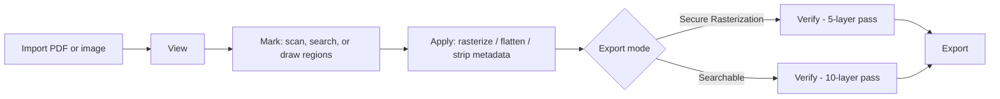
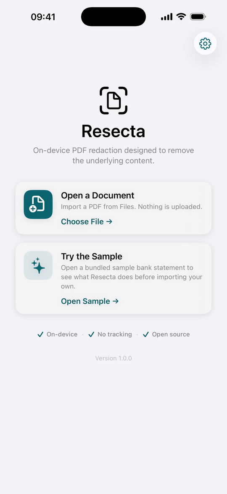
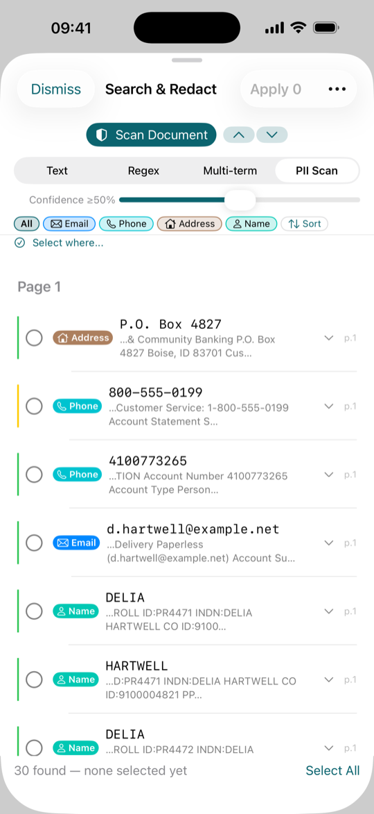
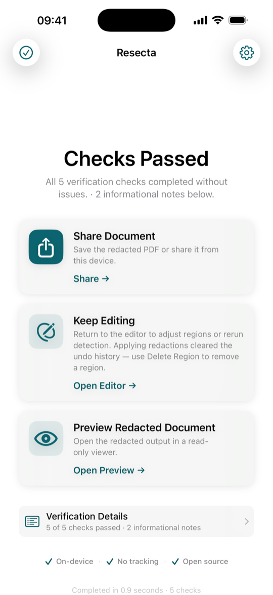

# Resecta

On-device iOS 26 PDF and image redaction. Free, open-source, zero data collection — all processing happens on your device.

**License:** [Apache License 2.0](./LICENSE)

**Version:** 1.0 — see the [CHANGELOG](./CHANGELOG.md).

---

## What it is

Resecta is a focused PDF and image redaction tool that operates entirely on your device. It is designed for anyone who needs to remove sensitive regions from PDFs or images before sharing them. The app makes no network requests of its own, does not create accounts, and does not collect analytics or telemetry.

## What it does

The core workflow is:

**Import → View → Mark → Apply → Verify → Export**

1. **Import** a PDF or image from Files, Photos, or drag-and-drop.
2. **View** pages and navigate the document.
3. **Mark** regions for redaction by drawing rectangles, or by selecting and applying results from Scan (on-device text detection) or Search (text, pattern, and multi-term matching).
4. **Apply** redaction. Each affected page is rasterized — vector text and images are converted into flat bitmap data, and the redaction process is designed to remove the original text layer in marked regions. Source document metadata (author, editing history, etc.) is stripped; the rebuilt file carries a generic producer tag and fresh creation/modification timestamps added by the system PDF writer, so the export is not metadata-free — see [`PRIVACY.md`](./PRIVACY.md).
5. **Verify.** A multi-layer verification engine scans the output for residual content using text extraction, OCR, binary string search across multiple encodings, structural analysis, and metadata checks.
6. **Export** via the system share sheet.

## Two modes

- **Secure Rasterization** — produces image-only output and is the simplest approach for high-sensitivity documents. Verification runs as a 5-layer check.
- **Searchable Redaction** — preserves non-redacted text for selectability and search, using a fresh monospace font designed to remove glyph-positioning side channels identified in academic research. Verification runs as a 10-layer check (the five additional checks cover the preserved-text layer).

Both modes share the same pixel-destruction core. Mode choice is per-document.

## Architecture

The end-to-end pipeline. The chosen export mode selects the verification pass:



_All stages run on-device; the redaction pipeline makes no network calls. Verification is a check, not a substitute for human review of the output._

## V1.0 known limitations

V1.0 ships the core workflow described above. The following items
were deliberately deferred to a future release:

- **No "Compose" search sub-mode.** The app ships two marking
  interfaces: Scan, which runs the on-device PII text detectors, and
  Search, with three modes (Text, Regex, Multi-term). A Compose mode
  for stacked filter combinations is V1.1+ scope.
- **No per-region exemption tagging.** User-defined detection terms
  live in a flat `UserTermsStore` (always-flag / never-flag lists)
  and `SavedRegexStore` (saved-regex library). Per-region FOIA
  exemption labels are V1.1+ scope.
- **No audit export.** The match-audit export surface is disabled in
  V1.0. Its v4 wire schema (`schemaVersion = 4`) ships in code for a
  future release; a v3 column-subset export path is V1.1+ scope.
- **Single-entry Custom Terms CRUD.** Bulk operations (paste-many,
  CSV import / export, share-profile) are V1.1+ scope.
- **Secure-enclave-backed persistence is V1.1+ scope.** V1.0 already
  retains Custom Terms (`UserTermsStore` always-flag / never-flag lists)
  and the saved-regex library (`SavedRegexStore`) across app launches by
  storing them in `UserDefaults` (keys `userTerms.v1` / `savedRegexes.v1`).
  Moving that storage to a secure-enclave-backed store is the deferred
  V1.1+ work.

See [`KNOWN_ISSUES.md`](./KNOWN_ISSUES.md) for the open-bug tracker.

## On-device operation

- No network: the codebase contains no `URLSession` or `NWConnection` usage. This is verifiable at the source level via grep.
- No accounts, no analytics, no telemetry, no server-side components.
- On-device PII detection uses regex patterns and `NLTagger` named-entity recognition; OCR for scanned pages uses the Vision framework. Nothing in the app creates, stores, or transmits biometric data.
- Sample documents, if any, are bundled into the app binary — not downloaded.

Users are responsible for verifying that redaction output meets their specific requirements before sharing documents.

## Threat model

Resecta is designed to address specific risks that arise when sharing redacted documents. The list below names what is in scope and what is not.

**In scope:**

- **Residual text after redaction.** Both modes are designed to rasterize affected pages and remove the original text layer from marked regions. The multi-layer verification pass scans the output for any text or character data that remains.
- **Document metadata leakage.** Author, editing history, tagged structure, and other source metadata fields are stripped from exported documents. The rebuilt file does carry a generic producer tag and fresh creation/modification timestamps from the system PDF writer — it is not metadata-free; see [`PRIVACY.md`](./PRIVACY.md).
- **Font-positioning side channels (Searchable Redaction).** The preserved text layer uses a fresh monospace font with uniform spacing, designed to remove the glyph-positioning side channels identified in academic research on sandwich PDFs.

**Out of scope:**

- **Compromised device.** Resecta runs on the user's device. If the device is compromised, the threat model assumes the attacker already has access to whatever the user is redacting.
- **Malicious input documents.** Resecta does not sandbox PDF parsers. A document crafted to exploit Apple's PDF or image stack is outside the scope of what this tool addresses.
- **Network adversaries.** Resecta makes no network requests of its own — the source contains no `URLSession` or `NWConnection` calls, verifiable at the source level via `grep`.
- **Human review of output.** Users are responsible for visually reviewing redacted documents before sharing. The verification pass is a check, not a substitute for review.

## How we verify these claims

Each load-bearing claim in this README is paired with a mechanical check in this repo. The map below is the short version; the depth, the design reasoning, and the honest limits of each check are in [`ENGINEERING.md`](./ENGINEERING.md).

| Claim | Check |
| --- | --- |
| Marked regions are destroyed, not covered | Per-region pixel readback after every fill — one wrong pixel fails the export (`Pipeline/PageRasterizer.swift`); the classic annotation-over-text attacks are constructed and destroyed in `SecurityTests/FakeRedactionTests.swift` |
| The exported file is re-checked independently | The 5/10-layer verification pass re-opens the output and scans text, OCR, raw bytes across five encodings, structure, and metadata (`Verification/VerificationEngine.swift`) |
| Placement survives rotated pages | A rotation × crop-box-origin test matrix positions its regions with a transform written independently of the production code (`SecurityTests/RotatedPageCoordinateTests.swift`) |
| No network requests of its own | A source grep for networking symbols returns no code references (the sole hit is a comment); the pre-commit hook rejects those symbols in any staged diff (`Scripts/audit-lint.sh`) |
| The app's own copy doesn't overclaim | A banned-vocabulary lint walks every localized string and the shipping docs (`Tests/ResectaAppTests/LegalPhraseLintTests.swift`, `Scripts/claims-lint.sh`) |
| Bundled detection data is what the pipeline signed | An Ed25519 signature over the gazetteer manifest is verified at load; failure degrades detection with a visible banner (`Detection/GazetteerLoader.swift`) |

## Project layout

App source lives in `Sources/ResectaApp/`. The redaction engine is an SPM package at [`Packages/RedactionEngine/`](./Packages/RedactionEngine/) — import-friendly for non-app consumers (a future macOS or CLI build) via standard SwiftPM.

## Contributor quickstart

A stranger can clone, build, and start contributing in under an hour with these steps:

1. **Clone and install hooks.**

   ```sh
   git clone https://github.com/Merlin1A/resecta.git
   cd resecta
   ./Scripts/install-hooks.sh
   ```

   The pre-commit hook enforces the mechanism-description language rules and audit-checklist gates documented in [`CONTRIBUTING.md`](./CONTRIBUTING.md). It is a symlink to `Scripts/audit-lint.sh`; never bypass with `--no-verify`.

2. **Generate the Xcode project.**

   ```sh
   ./regenerate.sh
   ```

   `ResectaApp.xcodeproj` is regenerated from `project.yml` via XcodeGen. Do not edit `project.pbxproj` by hand.

3. **Open in Xcode and build.**

   ```sh
   open ResectaApp.xcodeproj
   ```

   Select the **ResectaApp** scheme and an iPhone 17 simulator. Build with `⌘B`. The app target uses iOS 26 and Swift 6.2; the `RedactionEngine` SPM package requires Swift 6.2 strict concurrency.

4. **Run the test suites.**

   ```sh
   Scripts/test-batched.sh ResectaApp
   cd Packages/RedactionEngine && swift test --no-parallel
   ```

   The batched runner executes the app suites in serial batches on an iPhone 17 simulator (performance-budget suites run separately, report-only) to avoid simulator parallel-run flakiness; it ends with a `VERDICT: PASS` line and exit 0 on success. The engine package tests run serially via SwiftPM on the Mac host. Output and exit-code details are in the Tests section of [`CONTRIBUTING.md`](./CONTRIBUTING.md).

   Name and search tests exercise the system on-device name-recognition model (`NLTagger` `.nameType`), delivered as an on-demand OS asset. Run the app suites on a current iOS 26.x simulator runtime where that model is present; where the asset has not downloaded, those tests skip or report different counts rather than failing the build.

5. **Read the contributor guide** in [`CONTRIBUTING.md`](./CONTRIBUTING.md) for the branch model, commit format, audit checklist, and DCO sign-off requirement. Hard rules live in its "Hard Stops" section.

## Testing

The workflow the suites protect — import, scan, apply, verify (recorded before the current interface naming):


The test tree is larger than the source tree: roughly 54,000 lines of Swift source to roughly 73,000 lines of test code, about 1.4×. Counted from the current tree:

- **Engine package** (`Packages/RedactionEngine/Tests`) — 1,630 Swift Testing `@Test` functions across 213 suites: the pipeline and rasterization, the verification layers, the security suites (fake redaction, pixel destruction, rotated-page coordinates, adversarial verification), search, detection, and the corpus measurement harnesses.
- **App target** (`Tests/ResectaAppTests`) — 1,205 `@Test` functions across 177 suites: the pipeline state machine, cancellation and restart races, view-level predicates, and the honesty guards that keep the docs and UI copy accurate.
- **UI / end-to-end** (`Tests/ResectaAppUITests`) — 11 XCUITest methods that drive the built app on a simulator: the first-launch legal gate, detection review, and search-to-redaction flows.

Together the suites carry about 6,100 `#expect`/`#require` assertions. Beyond ordinary coverage, they pin the things this project cannot afford to regress: the named fake-redaction attacks (text under an opaque annotation must be destroyed at the text-layer, byte, and annotation level), the rotation × geometry placement matrix, fill-readback edge cases, cancellation and restart races, and the app's own copy — overclaiming is treated as a defect class with its own red tests. The reasoning behind that structure is in [`ENGINEERING.md`](./ENGINEERING.md).

Run both suites:

```sh
Scripts/test-batched.sh ResectaApp
cd Packages/RedactionEngine && swift test --no-parallel
```

The batched runner executes the app suites in serial batches on an iPhone 17 simulator and ends with a `VERDICT:` line; the engine package runs serially via SwiftPM on the Mac host. Output markers, exit codes, and the on-device name-model note are in the Tests section of [`CONTRIBUTING.md`](./CONTRIBUTING.md).

## Contributing

- Read [`CONTRIBUTING.md`](./CONTRIBUTING.md) for the workflow, commit conventions, audit gates, and the Hard Stops that require maintainer sign-off.
- Security issues: please use [`SECURITY.md`](./SECURITY.md) — do not file public issues for vulnerabilities.
- Feature work lands on `feat/*` branches.

## License

Licensed under the Apache License, Version 2.0. See [`LICENSE`](./LICENSE) for the full text.

## Screenshots

All captures show the app's bundled synthetic sample document — every visible value (names, accounts, addresses) is fictitious. The frames predate the current interface naming (the detection surface is now called Scan); refreshed captures are planned for a future release.

| Home | Scan results | Verification |
| --- | --- | --- |
|  |  |  |
