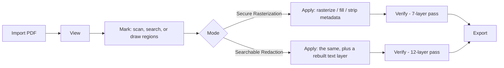

# Resecta

[](https://github.com/Merlin1A/resecta/actions/workflows/ci.yml)

[](https://apps.apple.com/us/app/resecta/id6786922787)

On-device iOS 26 PDF redaction. Free, open-source, zero data collection — all processing happens on your device.

**App Store:** [apps.apple.com/us/app/resecta/id6786922787](https://apps.apple.com/us/app/resecta/id6786922787) · **Website:** [resecta.app](https://resecta.app)

**License:** [Apache License 2.0](./LICENSE)

**Latest release:** 1.2.0 — see the [CHANGELOG](./CHANGELOG.md).

---

## What it is

Resecta is a focused PDF redaction tool that operates entirely on your device, for anyone who needs to remove sensitive regions from PDFs before sharing them. Marked regions are overwritten in the page's pixels — every page is rasterized and the file is rebuilt from those rasters — rather than covered with a box; a verification pass, on by default, then re-opens the output and checks it. The app makes no network requests of its own, does not create accounts, and does not collect analytics or telemetry.

**For reviewers.** The design reasoning and the check behind each claim are in [`ENGINEERING.md`](./ENGINEERING.md) (start at its "Where to start reading"); what the app defends and what it does not is [`THREAT-MODEL.md`](./THREAT-MODEL.md); the test tree is described under Testing below.

## What it does

The core workflow is:

**Import → View → Mark → Apply → Verify → Export**

1. **Import** a PDF from Files, or open the bundled sample document.
2. **View** pages and navigate the document.
3. **Mark** regions for redaction by drawing rectangles, or by selecting and applying results from Scan (on-device text detection) or Search (text, pattern, and multi-term matching).
4. **Apply** redaction. Every page is rasterized, marked or not — vector text and images are converted into flat bitmap data, marked regions are overwritten in those pixels, and the rebuilt file is designed to leave the original text layer out. Source metadata (author, editing history and the rest) is stripped; the rebuilt file carries a producer tag replaced with a fixed value, timestamps rewritten to a fixed date and a file identifier derived from the file's own bytes, so the export is not metadata-free — see [`PRIVACY.md`](./PRIVACY.md).
5. **Verify.** By default, a multi-layer verification engine then scans the output for residual content using text extraction, OCR, binary string search across multiple encodings, structural analysis, and metadata checks, re-runs each search you applied, and runs a detection sweep on the output.
6. **Export** via the system share sheet.

## Two modes

- **Secure Rasterization** — produces image-only output and is the simplest approach for high-sensitivity documents. Verification runs as a 7-layer check.
- **Searchable Redaction** — preserves non-redacted text for selectability and search, using a fresh monospace font designed to reduce the glyph-positioning side channels identified in academic research. Verification runs as a 12-layer check (the five additional checks cover the preserved-text layer). If any unmarked text on a page shows no ink — white on white, invisible, or under a box drawn into the page — that page is exported as an image only. The stated limit: text covered by a picture in the page can still enter the text layer.

Both modes share the same pixel-destruction core. Settings holds the default mode and each document can override it; Paranoid Mode pins Secure Rasterization.

## Architecture

The end-to-end pipeline. The mode shapes the applied output and selects the verification pass:


```mermaid
flowchart LR
  A[Import PDF] --> B[View]
  B --> C[Mark: scan, search, or draw regions]
  C --> E{Mode}
  E -->|Secure Rasterization| D1[Apply: rasterize / fill / strip metadata]
  E -->|Searchable Redaction| D2[Apply: the same, plus a rebuilt text layer]
  D1 --> F[Verify - 7-layer pass]
  D2 --> G[Verify - 12-layer pass]
  F --> H[Export]
  G --> H[Export]
```

_All stages run on-device; the redaction pipeline makes no network calls. Verification is a check, not a substitute for human review of the output._

## Known limitations

The following are deliberately not in this release:

- **No "Compose" search sub-mode.** The search sheet has two
  interfaces: Scan, which runs the on-device PII text detectors, and
  Search, with three modes (Text, Regex, Multi-term). A Compose mode
  for stacked filter combinations is not part of this release.
- **No per-region exemption tagging.** User-defined detection terms
  live in a flat `UserTermsStore` (always-flag / never-flag lists)
  and `SavedRegexStore` (saved-regex library); regions carry no FOIA
  exemption labels.
- **No audit export.** The match-audit export surface is disabled in
  this release; its v4 wire schema (`schemaVersion = 4`) ships in code.
- **Custom Terms are entered one at a time.** Bulk entry and sharing
  (paste-many, CSV import / export, share-profile) are not part of
  this release.
- **Secure-enclave-backed persistence is deferred to a later release.** Resecta
  retains Custom Terms (`UserTermsStore` always-flag / never-flag lists),
  the saved-regex library (`SavedRegexStore`) and saved searches
  (`SavedSearchStore`) across app launches as JSON files in the app's
  Application Support directory, written with the `complete`
  file-protection class and flagged for exclusion from device backups.
  Encrypting that storage under a Secure Enclave–backed key is the
  deferred work.

See [`KNOWN_ISSUES.md`](./KNOWN_ISSUES.md) for the open-bug tracker.

## On-device operation

- No network requests of its own: the source contains no `URLSession` or `NWConnection` usage (the check is in [How we verify these claims](#how-we-verify-these-claims)).
- No accounts, no analytics, no telemetry, no server-side components.
- On-device detection combines regex patterns and checksum validators, bundled gazetteers and context scoring, `NLTagger` named-entity recognition for names, and Vision for OCR.
- The sample document is bundled in the app — not downloaded.

Users are responsible for verifying that redaction output meets their specific requirements before sharing documents.

## Threat model

Resecta is designed to address specific risks that arise when sharing redacted documents. The list below names what is in scope and what is not; the full model — assets, adversaries, trust boundaries, accepted risks and a dated security-posture table — is [`THREAT-MODEL.md`](./THREAT-MODEL.md).

**In scope:**

- **Residual text after redaction.** Both modes are designed to rasterize every page and leave the original text layer out of the rebuilt file; Searchable Redaction adds a rebuilt layer holding only unmarked text. The multi-layer verification pass then checks the output for redacted text that remains.
- **Document metadata leakage.** Author, editing history, tagged structure, and other source metadata fields are stripped from exported documents. The rebuilt file does carry a producer tag — replaced with a fixed value ("Resecta") that identifies neither the operating system version nor the build — the writer's creation/modification timestamps, rewritten to a fixed date, and a file identifier derived from the file's own bytes; it is not metadata-free. See [`PRIVACY.md`](./PRIVACY.md).
- **Font-positioning side channels (Searchable Redaction).** The rebuilt text layer is drawn in a fresh monospace font on a uniform per-line pitch, designed to reduce the glyph-positioning side channels identified in academic research on PDFs that pair a page image with a hidden text layer.

**Out of scope:**

- **Compromised device.** Resecta runs on the user's device. If the device is compromised, the threat model assumes the attacker already has access to whatever the user is redacting.
- **Exploits of Apple's PDF and image frameworks.** Resecta does not sandbox them; a document crafted to exploit them is outside the scope of what this tool addresses.
- **Network adversaries.** Resecta makes no network requests of its own.
- **Human review of output.** Users are responsible for visually reviewing redacted documents before sharing. The verification pass is a check, not a substitute for review.

## How we verify these claims

Each claim in the map below is paired with a mechanical check in this repo. The map is the short version; the depth, the design reasoning, and the honest limits of each check are in [`ENGINEERING.md`](./ENGINEERING.md). Paths in the map that do not start with `Scripts/` or `Tests/` are inside the engine package's sources or tests.

| Claim | Check |
| --- | --- |
| Marked regions are destroyed, not covered | Per-region pixel readback after every fill (`Pipeline/PageRasterizer.swift`) — one wrong pixel fails the render, the page is re-rendered once at the lowest resolution tier, and a second failure fails the export; the classic annotation-over-text attacks are constructed and destroyed in `SecurityTests/FakeRedactionTests.swift` |
| The exported file is re-checked independently | The 7/12-layer verification pass re-opens the output and scans its text, OCR of its rendered pages, the raw bytes across seven encodings (outside stream data) plus each page's decoded text, its structure and its metadata, re-runs each applied search on the output, and runs the app's structured detectors on the output to report what remains — names and addresses are not swept (`Verification/VerificationEngine.swift`) |
| Placement survives rotated pages | A rotation × crop-box-origin test matrix positions its regions with a transform written independently of the production code (`SecurityTests/RotatedPageCoordinateTests.swift`) |
| No network requests of its own | A source grep for networking symbols returns no code references (the sole hit is a comment); the pre-commit hook rejects those symbols on added Swift source lines (`Scripts/audit-lint.sh`) |
| The app's own copy is linted for overclaiming vocabulary | A banned-vocabulary lint walks the legal string catalog, the view layer's string literals and the shipping docs (`Tests/ResectaAppTests/LegalPhraseLintTests.swift`, `Scripts/claims-lint.sh`) |
| Bundled detection data is what the pipeline signed | An Ed25519 signature over the gazetteer manifest is verified at load; failure degrades detection with a visible banner (`Detection/GazetteerLoader.swift`) |

## Project layout

App source lives in `Sources/ResectaApp/`. The redaction engine is an SPM package at [`Packages/RedactionEngine/`](./Packages/RedactionEngine/), consumed through standard SwiftPM (the package also builds on macOS for host-side tests; there is no macOS app).

## Contributor quickstart

1. **Clone and install hooks.**

   ```sh
   git clone https://github.com/Merlin1A/resecta.git
   cd resecta
   ./Scripts/install-hooks.sh
   ```

   The pre-commit hook is a symlink to `Scripts/audit-lint.sh`, which runs the mechanical checks described in [`CONTRIBUTING.md`](./CONTRIBUTING.md); the pre-push hook runs both test schemes. Never bypass them with `--no-verify`.

2. **Generate the Xcode project.**

   ```sh
   ./regenerate.sh
   ```

   `ResectaApp.xcodeproj` is regenerated from `project.yml` via XcodeGen. Do not edit `project.pbxproj` by hand.

3. **Open in Xcode and build.**

   ```sh
   open ResectaApp.xcodeproj
   ```

   Select the **ResectaApp** scheme and an iPhone 17 simulator. Build with `⌘B`. The app target uses iOS 26 and Swift 6.2; the `RedactionEngine` SPM package builds with the Swift 6.2 toolchain under strict concurrency checking.

Tests and gates: [`CONTRIBUTING.md`](./CONTRIBUTING.md).

## Testing

The test tree is larger than the source tree: roughly 68,000 lines of Swift source to roughly 102,000 lines of test code, about 1.5×. Counted from the current tree:

- **Engine package** (`Packages/RedactionEngine/Tests`) — 1,992 Swift Testing `@Test` functions across 270 suites: the pipeline and rasterization, the verification layers, the security suites (fake redaction, pixel destruction, rotated-page coordinates, adversarial verification), search, detection, and the corpus measurement harnesses.
- **App target** (`Tests/ResectaAppTests`) — 1,711 `@Test` functions across 243 suites: the pipeline state machine, cancellation and restart races, view-level predicates, and the honesty guards that keep the docs and UI copy accurate.
- **UI / end-to-end** (`Tests/ResectaAppUITests`) — 50 XCUITest methods that drive the built app on a simulator (run from Xcode; the batched runner and CI build them without running them): the first-launch legal gate, search-to-redaction flows, the search re-check on the results screen, and the editor's handling of links inside a document.

Together the suites carry about 9,300 `#expect`/`#require` assertions. Beyond ordinary coverage, they pin the things this project cannot afford to regress: the named fake-redaction attacks (text under an opaque annotation must be destroyed at the text-layer, byte, and annotation level), the rotation × geometry placement matrix, fill-readback edge cases, cancellation and restart races, and the app's own copy — overclaiming is treated as a defect class with its own red tests. The reasoning behind that structure is in [`ENGINEERING.md`](./ENGINEERING.md).

The commands that run both suites locally, and what the batched runner reports, are in [`CONTRIBUTING.md`](./CONTRIBUTING.md#running-the-tests).

**On GitHub Actions.** Every pull request runs the required `pr-gate` check (`ci.yml`), which builds the app and its unit- and UI-test bundles without running them and runs the lint, count and hash checks. The app's unit suite also runs on a hosted simulator for every pull request to `main`, as a non-required check, and both schemes (app and engine) run weekly and on release tags; the engine's host-side workflow has not yet reached a verdict on the hosted runner. The full gate list is in [`CONTRIBUTING.md`](./CONTRIBUTING.md#what-every-change-passes).

## Contributing

- Read [`CONTRIBUTING.md`](./CONTRIBUTING.md) for the gates every change passes and the changes that need an agreed plan before they land.
- Security issues: please use [`SECURITY.md`](./SECURITY.md) — do not file public issues for vulnerabilities.

## License

Licensed under the Apache License, Version 2.0. See [`LICENSE`](./LICENSE) for the full text.
